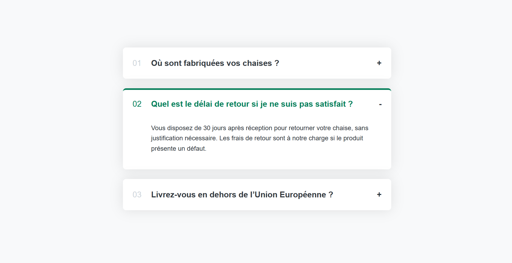

# React FAQ Accordion

Une interface simple et élégante en React permettant d'afficher une section **FAQ** (Foire Aux Questions) sous forme d'accordéon interactif.

Chaque question peut être ouverte individuellement, et l'élément précédemment ouvert se referme automatiquement pour garantir une meilleure lisibilité.

## ✨ Fonctionnalités

- Interface propre et responsive
- Accordéon en React avec `useState`
- Un seul élément ouvert à la fois
- Design configurable via CSS

## 📸 Capture d'écran

